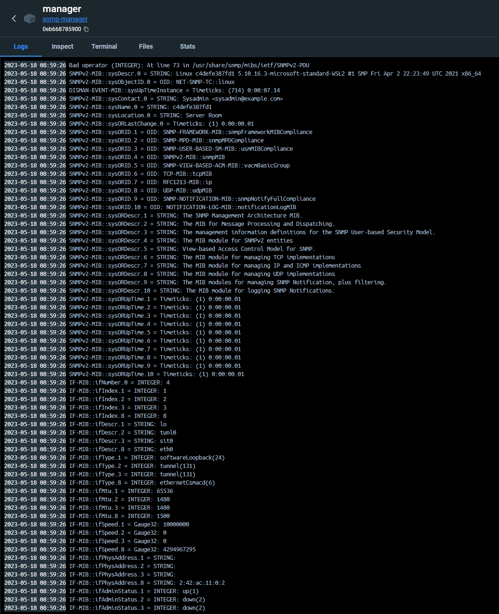
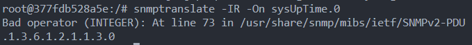
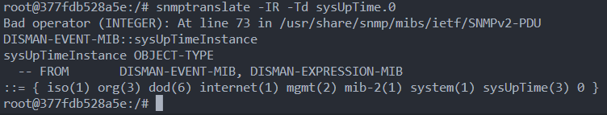
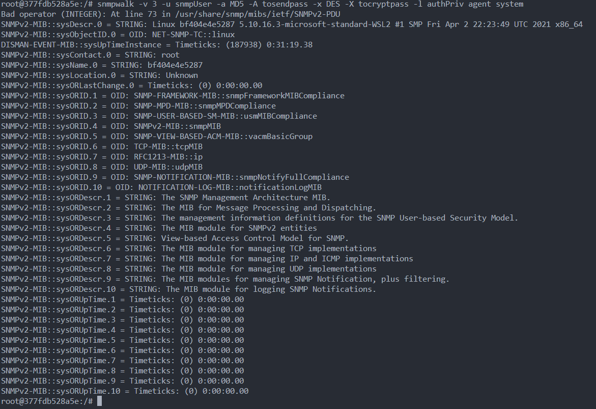
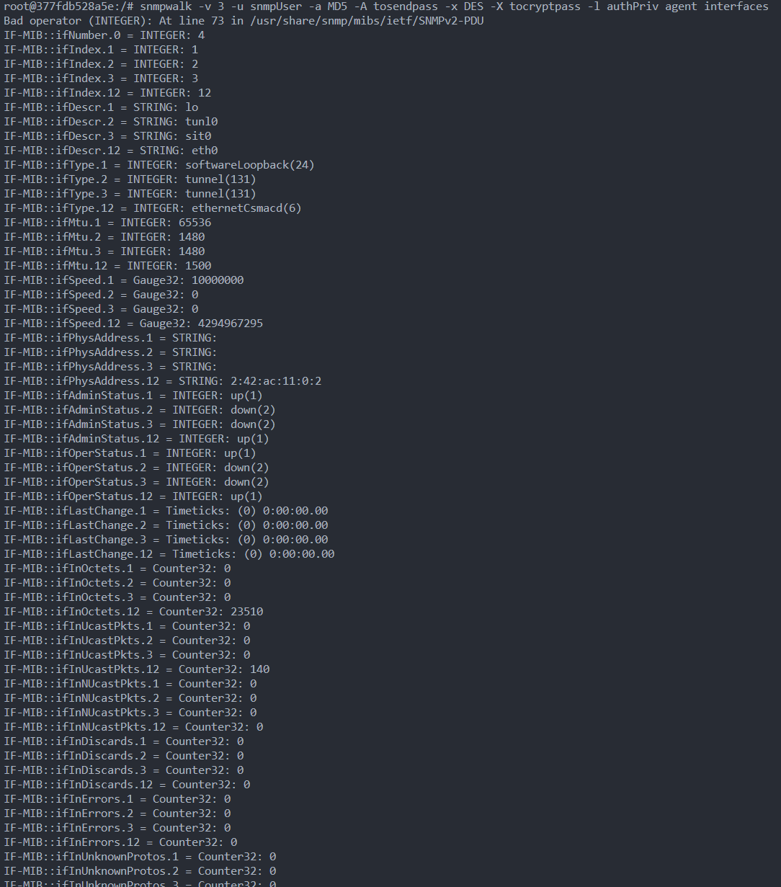

# Laborprotokoll: SNMP Netzwerk-Simulation mit Docker und Confidentiality & Authenticity

### Arbeitsgeber: TFO Max Valier

### Author: Massimiliano Mola

# Index

- [Laborprotokoll: SNMP Netzwerk-Simulation mit Docker und Confidentiality \& Authenticity](#laborprotokoll-snmp-netzwerk-simulation-mit-docker-und-confidentiality--authenticity)
    - [Arbeitsgeber: TFO Max Valier](#arbeitsgeber-tfo-max-valier)
    - [Author: Massimiliano Mola](#author-massimiliano-mola)
- [Index](#index)
  - [Aufgabenstellung](#aufgabenstellung)
  - [Verwendete Werkzeuge:](#verwendete-werkzeuge)
  - [Grundlagen - Theorie:](#grundlagen---theorie)
    - [Docker-Container](#docker-container)
    - [SNMP](#snmp)
    - [OID und MIB](#oid-und-mib)
    - [Authentifizierung in SNMPv3](#authentifizierung-in-snmpv3)
  - [Versuchsdurchführung:](#versuchsdurchführung)
    - [1. agent demon Konfigurieren:](#1-agent-demon-konfigurieren)
      - [snmpd.conf](#snmpdconf)
    - [2. Docker-Container erstellen](#2-docker-container-erstellen)
      - [Dockerfile-Agent:](#dockerfile-agent)
      - [Dockerfile-Manager:](#dockerfile-manager)
    - [3. Docker-Images erstellen](#3-docker-images-erstellen)
    - [4. Docker-Container starten](#4-docker-container-starten)
      - [kontrolle](#kontrolle)
    - [5. Confidentiallity und Authenticity](#5-confidentiallity-und-authenticity)
      - [snmpd.conf](#snmpdconf-1)
      - [Dockerfile-Manager](#dockerfile-manager-1)
    - [6. Container mit AuthPriv](#6-container-mit-authpriv)
  - [Ergebnise](#ergebnise)
- [TODO allgemein erklaren](#todo-allgemein-erklaren)
    - [snmptranslate](#snmptranslate)
      - [Übersetzung von OIDs zu MIB-Namen](#übersetzung-von-oids-zu-mib-namen)
      - [Anzeige des MIB-Baums](#anzeige-des-mib-baums)
    - [snmpwalk](#snmpwalk)
- [Fazit](#fazit)

## Aufgabenstellung

Unsere Aufgabe ist es, eine Netzwerksimulation mit Simple Network Management Protocol (SNMP) zu erstellen. Ziel ist das Einrichten und Konfigurieren von Docker-Containern als SNMP-Agenten und Manager. Zusäzlich sollen man die Vertraulichkeit und Authentizität in unserem SNMP-Setup sicherstellen. Schließlich die Überprüfung der Funktionalität und Sicherheit unseres Systems durch verschiedene SNMP-Operationen. 

## Verwendete Werkzeuge:

- Docker
- Text Editor (z.B. VS code)
- SNMP (Simple Network Management Protocol)
- SNMPD (SNMP Daemon)
- snmp-mibs-downloader (um MIBs zu verwenden)

## Grundlagen - Theorie:

### Docker-Container

Docker-Container sind leichtgewichtige, eigenständige Softwarepaketeinheiten, die alles enthalten, was zum Ausführen von Code benötigt wird. In unserem SNMP-Beispiel verwenden wir Container Linking, um eine Verbindung zwischen dem SNMP-Agent und dem SNMP-Manager herzustellen, sodass sie miteinander kommunizieren können.

### SNMP

Das Simple Network Management Protocol (SNMP) ist ein Internet-Standardprotokoll, das zum Sammeln und Organisieren von Informationen über verwaltete Geräte in IP-Netzwerken und zum Modifizieren dieser Informationen verwendet wird. Geräte, die in der Regel SNMP unterstützen, umfassen Router, Switches, Server, Arbeitsstationen, Drucker und mehr.

### OID und MIB

In SNMP bezeichnet eine Object Identifier (OID) eine eindeutige Kennung, die verwendet wird, um ein Objekt in der MIB-Hierarchie zu identifizieren. Die Management Information Base (MIB) ist eine Sammlung von Definitionsdateien, die Objekte repräsentieren, die von einem SNMP-fähigen Gerät verwaltet werden. Jede OID identifiziert ein eindeutiges Attribut, das auf dem Gerät verwaltet wird, wie z.B. cpuUsage oder sysUpTime.

### Authentifizierung in SNMPv3

Die Authentifizierung in SNMPv3 erfolgt durch das User-based Security Model (USM), das verschiedene Authentifizierungs- und Verschlüsselungsmechanismen unterstützt. Wir werden  "authPriv" (Authentifizierung und Privatsphäre) verwenden. Die Authentifizierung stellt sicher, dass die SNMP-Nachrichten tatsächlich von einem gültigen Benutzer stammen, während die Verschlüsselung die Vertraulichkeit der Nachrichten gewährleistet. Dabei wird gewöhnlich ein Benutzername und ein Passwort für die Authentifizierung sowie ein weiteres Passwort für die Verschlüsselung genutzt.

## Versuchsdurchführung:

Wir werden zunächst Docker verwenden, um ein sicheres Netzwerkumfeld zu schaffen. Dabei erstellen wir zwei Container: den Manager und den Agenten. Wir werden auch eine Konfigurationsdatei für den SNMP-Dienst, snmpd erstellen. In dieser Datei implementieren wir zusätzliche Sicherheitsmaßnahmen, indem wir einen speziellen Benutzer definieren. Dieser Benutzer wird die Befugnis haben, auf die Daten des Agenten sicher zuzugreifen.
### 1. agent demon Konfigurieren:

Wir erstellen eine Datei zur Konfiguration des SNMP-Demon namens `snmpd.conf`
#### snmpd.conf

```conf
# Change the agentAddress line to listen to all addresses
agentAddress udp:161

# Set the community string to 'public'
rocommunity public

# Disk monitoring
disk / 10000
```

In dieser speziellen snmpd.conf-Datei:

1. `agentAddress udp:161`: Dies legt fest, dass der SNMP-Agent auf allen Netzwerkadressen des Hosts auf Port 161 lauscht, und zwar über das UDP-Protokoll. SNMP verwendet standardmäßig UDP für die Kommunikation.

2. `rocommunity public`: Hier wird die "read-only"-Community auf "public" gesetzt. Eine Community in SNMP ist vergleichbar mit einem Passwort. Mit der Angabe "public" wird ein gängiger Standardwert für SNMP verwendet. Da es "read-only" ist, können Mitglieder dieser Community Daten vom Agent abrufen, aber keine Änderungen vornehmen.

3. `disk / 10000`: snmpd hat viele einstellungen z.B. dies ist eine Anweisung zur Überwachung des Dateisystems. In diesem Fall wird das Root-Dateisystem ("/") überwacht und eine Warnung ausgegeben, wenn weniger als 10.000 kB Speicherplatz verfügbar sind. Es dient dazu, den verfügbaren Speicherplatz auf dem Server zu überwachen und zu verwalten.

Zu bemerken, das jetzt noch keine Authentifizierung eingestellt ist
### 2. Docker-Container erstellen

Wir erstellen zwei Docker-Container: einen SNMP-Agent und einen SNMP-Manager.

#### Dockerfile-Agent:

```Dockerfile
# Basierend auf Ubuntu 20.04
FROM ubuntu:20.04

# Umgebung einrichten
ENV DEBIAN_FRONTEND=noninteractive

# Pakete aktualisieren und notwendige installieren
RUN apt-get update && apt-get install -y snmpd

# SNMP-Konfiguration zum Container kopieren
COPY snmpd.conf /etc/snmp/snmpd.conf

# SNMP-Port freigeben
EXPOSE 161/udp

# SNMP-Daemon ausführen
CMD ["snmpd", "-f"]
```

Hierbei ist zu beachten:

- `FROM` definiert das Basis-Image für den Container, in diesem Fall Ubuntu 20.04, aber jede distro sollte für dises projekt funktionieren.
- `ENV` setzt eine Umgebungsvariable, `DEBIAN_FRONTEND=noninteractive` sorgt dafür, dass `apt-get` im nicht-interaktiven Modus läuft.
- `RUN` führt Befehle aus, in diesem Fall wird die Paketliste aktualisiert und snmpd installiert.
- `COPY` kopiert Dateien vom Host-System in den Container.
- `EXPOSE` gibt den angegebenen Port frei, in diesem Fall den UDP-Port 161 für SNMP.
- `CMD` definiert den Standardbefehl, der beim Start des Containers ausgeführt wird. In diesem fall startet er den SNMP-Demon.

#### Dockerfile-Manager:

```Dockerfile
FROM ubuntu:20.04

# Setting up environment
ENV DEBIAN_FRONTEND=noninteractive
ENV MIBS ALL

# Updating and installing necessary packages
RUN apt-get update && apt-get install -y snmp snmp-mibs-downloader

# Run the SNMP walk
CMD ["snmpwalk", "-v", "2c", "-c", "public", "agent", "1.3.6"]
```

Der Container ist ähnlich doch mit folgenden unterschieden

-  `snmp-mibs-downloader` wird zusäzlich installiert.
-  `ENV MIBS ALL` ist eine Umgebungsvariable, die bestimmt auf welche MIBs unsere Befehle zugriff haben. 
   - `SNMPv2-MIB`: Manages SNMPv2 implementations.
   - `IF-MIB`: Manages network interface data.
   - `IP-MIB`: Manages IP layer information.
   - `TCP-MIB`: Manages TCP layer data.
   - `UDP-MIB`: Manages UDP layer information.
   - `HOST-RESOURCES-MIB`: Provides system resources data.
   - `ENTITY-MIB`: Provides physical entity data.
   - `CISCO-SYSLOG-MIB`: Manages Cisco system logging.  
 - `snmpwalk`:  um den gesamten Datenbaum von einem SNMP-fähigen Gerät abzurufen
   - `-v 2c`: Diese Option gibt die zu verwendende SNMP-Protokollversion an.
   - `-c public`: Diese Option gibt die zu verwendende Community-Zeichenkette in der SNMP-Kommunikation an. Die Community-Zeichenkette ist wie eine Benutzer-ID oder ein Passwort, das den Zugang zu den SNMP-Daten eines Geräts ermöglicht.
   - `agent`: Dies ist der Hostname oder die IP-Adresse des Geräts (Agent), auf dem der SNMP-Baum durchlaufen werden soll.
   - `1.3.6`: Dies ist die root-OID (Object Identifier), von der aus der SNMP-Walk beginnen soll.

### 3. Docker-Images erstellen

Wir erstellen Docker-Images aus den Dockerfiles:

```bash
docker build -f Dockerfile-agent -t snmp-agent .
docker build -f Dockerfile-manager -t snmp-manager .
```

Hierbei ist zu beachten:

- docker build erstellt ein Docker-Image.
- `-f` Dockerfile-agent und -f Dockerfile-manager geben das zu verwendende Dockerfile an.
- `-t snmp-agent` und `-t snmp-manager` setzen den Namen des erstellten Images.
- `.` gibt den Kontext für den Build-Befehl an, in diesem Fall das aktuelle Verzeichnis.

### 4. Docker-Container starten

Wir starten die Docker-Container aus den erstellten Images:

```bash
docker run -d --name=agent snmp-agent
docker run -it --name=manager --link agent:agent snmp-manager
```

Hierbei ist zu beachten:

- `docker run` startet einen Docker-Container.
- `-d` startet den Container im Hintergrund.
- `--name agent` und `--name manager` setzen den Namen des Containers.
- `--link agent:agent` verbindet den Manager-Container mit dem Agent-Container.
- `-it` startet den Container in einem interaktiven Terminal.

#### kontrolle

Nachdem wir den Manager starten sollte er sich nach dem er den snmpwalk Befehl ausgeführt hat sich wieder schließen. Im `log` sollte der `Datenbaum vom agent` sich befinden 



### 5. Confidentiallity und Authenticity

Um Confidentiallity und Authenticity zu gewehrleisten müssen wir zuerste einen User erstellen:

#### snmpd.conf
```conf
# Lissen to all addresses
agentAddress udp:161

# Create an SNMPv3 user
createUser snmpUser MD5 tosendpass DES tocryptpass
rwuser snmpUser

# Disk monitoring
disk / 10000
```

1. Löschen wir die `rocommunity public` Zeile
2. `createUser snmpUser MD5 tosendpass DES tocryptpass`: Diese Zeile erstellt einen neuen Benutzer namens snmpUser. Der Benutzer wird mit den folgenden Optionen konfiguriert:
   - `MD5 tosendpass`: Dies konfiguriert den Benutzer mit MD5 als Authentifizierungsprotokoll und tosendpass als Authentifizierungspasswort, man kann auch `SHA` als Authentifizierungsprotokoll verwenden.
   - `DES tocryptpass`: Dies setzt DES als Datenschutzprotokoll und tocryptpass als Datenschutzpasswort. Das Datenschutzprotokoll wird verwendet, um die Daten in SNMPv3-Paketen zu verschlüsseln, was die Vertraulichkeit der Daten gewährleistet, man kann auch `AES` als Verschlüsselungsprotokoll verwenden.
3. `rwuser snmpUser`: Diese Zeile gibt dem snmpUser Lese- und Schreibzugriff. Die rwuser-Direktive gewährt sowohl Lese- als auch Schreibzugriff auf den Benutzer, was bedeutet, dass der Benutzer SNMP-Objekte abrufen und ändern kann.

#### Dockerfile-Manager
Wir können zusäzlich die letzte file des `Dokerfile-Manager` löschen

```Dockerfile
FROM ubuntu:20.04

# Setting up environment
ENV DEBIAN_FRONTEND=noninteractive
ENV MIBS ALL

# Updating and installing necessary packages
RUN apt-get update && apt-get install -y snmp snmp-mibs-downloader
```

### 6. Container mit AuthPriv

Wir erstellen erneut Docker-Images aus den Dockerfiles:

```bash
docker build -f Dockerfile-agent -t snmp-agent .
docker build -f Dockerfile-manager -t snmp-manager .
```

Wir starten die Docker-Container aus den erstellten Images:

```bash
docker run -d --name=agent snmp-agent
docker run -it --name=manager --link agent:agent snmp-manager /bin/bash
```

Wir starten diesmal auch die `bash` am manager Container indem wir `bin/bash` am ende hinzufügen

## Ergebnise
# TODO allgemein erklaren

In disem Teil des Protokoll werden wir auf unserem System die Befehle `snmptranslate` und `snmpwalk` ausführen um informazionen von unserem system und dem SNMP-Agent auslesen.

### snmptranslate

`snmptranslate` ist ein Werkzeug, das mit der Net-SNMP-Suite kommt. Es dient dazu, zwischen numerischen und textuellen SNMP-Objektbezeichnern hin und her zu übersetzen, die in MIBs (Management Information Base) definiert sind.

#### Übersetzung von OIDs zu MIB-Namen

Zum Beispiel kann die numerische OID 1.3.6.1.2.1.1.3.0 in den textuellen Bezeichner SNMPv2-MIB::sysUpTime.0 übersetzt werden.
Der Befehl `snmptranslate -IR -On -Td SNMPv2-MIB::sysUpTime.0` wird verwendet, um eine MIB (Management Information Base) zu interpretieren und die Bedeutung einer OID (Object Identifier) in einem leichter verständlichen Format darzustellen. Hier ist die Bedeutung jeder Option:

- `-IR`: Diese Option ermöglicht die Verwendung der inversen Suche nach den Bezeichnungen von Registrierungen. Das bedeutet, Sie können den letzten Teil des MIB-Namen eingeben, anstatt den vollständigen Pfad anzugeben.

- `-On`: Diese Option stellt sicher, dass die Ausgabe in numerischer Form angezeigt wird. Das bedeutet, dass die OID numerisch anstatt textuell ausgegeben wird, was hilfreich sein kann, wenn Sie die genaue numerische OID kennen müssen.

- `-Td`: Diese Option aktiviert die ausführliche Baumdarstellung in der Ausgabe. Es gibt zusätzliche Informationen zur Struktur der MIB.


```bash
snmptranslate -IR -On sysUpTime.0
```



#### Anzeige des MIB-Baums

```bash
snmptranslate -IR -Td sysUpTime.0
```


### snmpwalk

```bash
snmpwalk -v 3 -u snmpUser -a MD5 -A tosendpass -x DES -X tocryptpass -l authPriv agent interface 
```

Der Befehl `snmpwalk -v 3 -u snmpUser -a MD5 -A tosendpass -x DES -X tocryptpass -l authPriv agent system` verwendet das SNMPv3-Protokoll, um einen SNMP-Agenten nach MIB-Objekten ab "system" zu befragen. Hier ist, was jeder Teil des Befehls bedeutet:

- `snmpwalk`: Dies ist das verwendete Kommandozeilen-Tool, welches einen Baum von Daten abruft, indem es kontinuierlich GETNEXT-Anfragen ab dem angegebenen Objekt durchführt.

- `-v 3`: Diese Option legt die zu verwendende SNMP-Version fest. In diesem Fall ist es SNMPv3.

- `-u snmpUser`: Diese Option legt den SNMPv3-Sicherheitsnamen (im Grunde den Benutzernamen) fest. Hier wird es auf "snmpUser" gesetzt.

- `-a MD5`: Dies legt das Authentifizierungsprotokoll auf MD5 fest. SNMPv3 ermöglicht die Authentifizierung von Nachrichten, um zu überprüfen, ob eine empfangene Nachricht gleich ist wie beim Versand. MD5 und SHA sind die am häufigsten verwendeten Protokolle dafür.

- `-A tosendpass`: Diese Option legt das Authentifizierungspasswort auf "tosendpass" fest, das in Verbindung mit der obigen `-a`-Option für die Nachrichtenauthentifizierung verwendet wird.

- `-x DES`: Dies legt das Datenschutzprotokoll auf DES fest. SNMPv3 ermöglicht die Verschlüsselung von Nachrichten zum Schutz der Privatsphäre, und DES (Data Encryption Standard) ist eines der Protokolle, die dafür verwendet werden können. AES ist ein weiteres häufig verwendetes Protokoll.

- `-X tocryptpass`: Diese Option legt das Datenschutzpasswort auf "tocryptpass" fest, das in Verbindung mit der `-x`-Option für die Nachrichtenverschlüsselung verwendet wird.

- `-l authPriv`: Diese Option legt die Sicherheitsstufe auf "authPriv" fest, was bedeutet, dass Nachrichten sowohl authentifiziert als auch verschlüsselt sein müssen.

- `agent`: Dies repräsentiert den Ziel-SNMP-Agenten (das System, das Sie abfragen). Dies wäre typischerweise der Hostname oder die IP-Adresse des SNMP-fähigen Geräts.

- `system`: Dies ist der MIB (Management Information Base) Objekt-Identifikator, von dem aus snmpwalk Daten abzurufen beginnt.




dies macht tdas selbe für die interfaces

```bash
snmpwalk -v 3 -u snmpUser -a MD5 -A tosendpass -x DES -X tocryptpass -l authPriv agent system 
```




# Fazit

In diesem Projekt haben wir erfolgreich ein SNMP-Netzwerk aufgebaut, bestehend aus einem Manager und einem Agenten, eingebettet in Docker-Containern. Mit der Einrichtung von SNMP und der Schaffung eines sicheren Benutzers zur Datenabfrage, ist es uns gelungen, eine effiziente und sichere Umgebung zur Netzwerküberwachung zu erstellen.

Unser System erfüllt derzeit die grundlegenden Anforderungen für ein effektives Netzwerk-Monitoring. Dennoch gibt es immer Raum für Verbesserungen und Erweiterungen. Beispielsweise könnten wir zusätzliche SNMP-Agenten hinzufügen, um mehrere Netzwerkknoten überwachen zu können. Darüber hinaus könnten wir unsere Konfiguration erweitern, um benutzerdefinierte MIBs (Management Information Base) einzuführen, die spezifischere oder komplexere Netzwerkinformationen bereitstellen können.

Zudem wäre es sinnvoll, das System so anzupassen, dass es automatische Benachrichtigungen versendet, wenn bestimmte Schwellenwerte erreicht oder überschritten werden, was eine proaktivere Netzwerküberwachung ermöglichen würde.

# Quellen

- https://stackoverflow.com/questions/72802602/snmp-translate-for-commonobjs
- https://stackoverflow.com/questions/34797948/format-of-snmpwalk-instruction
- https://oidref.com/1.3.6.1.2.1 
- https://stackoverflow.com/questions/63663312/snmpwalk-cannot-find-module 
